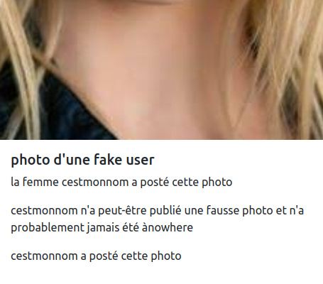

# amazon-tea

- télécharge le haarcascade_frontalface_default.xml et copie le à la racine
- ajoute un (e) nouvelle utilisateur pour te connecter
choisis un sport un quote
- une quote, qui a nom personne, m/f, job
- serveur songs detct artist f/ m
- quotes detect if f / m
- pics

- fake employee a des lunettes de soleil (library python),  et publie des fausse photos à employee , qui publie qui vrais photos a fake employee
- You don't need to activate the virtual env if you just want to execute a script and exit. Activation of a virtual enviroment is just a handy way to replace the python executable by adjusting the PATH1. So, the command

- $ source path/to/myenv/bin/activate
- $ python myscript.py
- $ deactivate

can be effectively replaced with

- $ path/to/myenv/bin/python myscript.py

